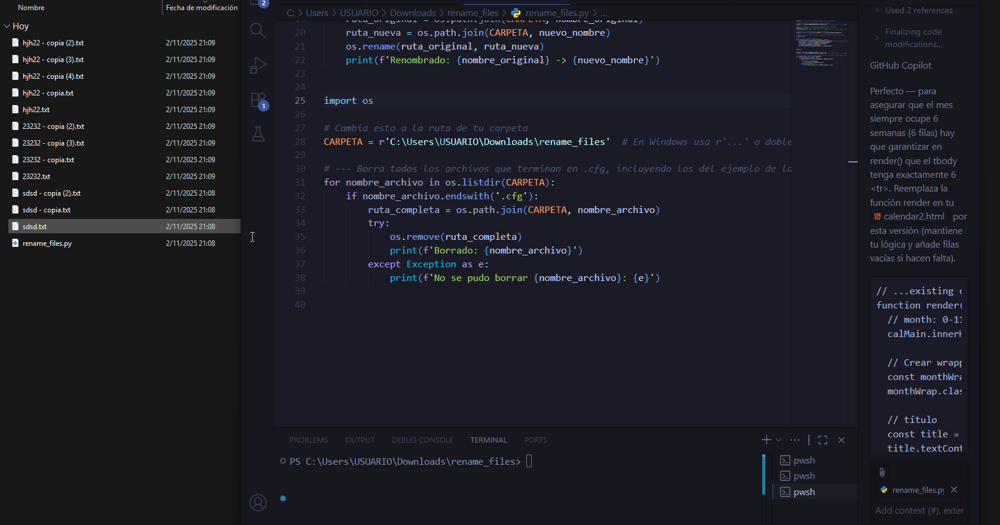

# 🗂️ Script Python para Renombrar y Borrar Archivos Masivamente

---

📘 Descripción

Este script renombra todos los archivos de una carpeta para ordenarlos con numeración consecutiva (ej: `archivo_001.txt`, `archivo_002.txt`, ...) y elimina automáticamente todos los archivos con extensión `.cfg` (por ejemplo, archivos temporales como `.terabox.uploading.cfg`).

Ideal para organizar fotos, documentos, datos masivos y limpiar archivos residuales generados por sincronizaciones.

---

🧰 Tecnologías Utilizadas

🐍 Python 3.x

---

## 🖼️ Vista previa


---

## 📊 Características

- Renombra cientos de archivos según un patrón configurable (`archivo_001.txt`, `archivo_002.txt`, ...).
- Elimina todos los archivos con la extensión `.cfg` después de renombrar.
- Fácil de adaptar a cualquier extensión de archivo (`.jpg`, `.png`, `.txt`, etc).
- Funciona en Windows, Linux y MacOS.
- Proceso seguro y rápido. Incluye impresión de resultados en consola.

---

## 📊 Instalación y Uso

1. **Instala Python 3.x:**  
   Descárgalo de [python.org](https://www.python.org/).

2. **Prepara la carpeta:**  
   Copia todos los archivos a renombrar dentro de una sola carpeta.

3. **Guarda el script:**  
   Descarga el archivo `rename_files.py` en esa carpeta.

4. **Configura la ruta en el script:**  
   Modifica la variable `CARPETA` en el script por la ruta de tu carpeta.

5. **Ejecuta el script:**  
   - En la terminal, navega a la carpeta y ejecuta:
     ```
     python rename_files.py
     ```
   - El script renombrará y luego eliminará los `.cfg` automáticamente.

---

## Ejemplo de código

CARPETA = r'C:\ruta\a\tu\carpeta'
nombre_base = 'archivo_'
extension_destino = '.txt'

Renombrar archivos
archivos = [f for f in os.listdir(CARPETA) if f.endswith(extension_destino)]
archivos.sort()
for i, nombre_original in enumerate(archivos, start=1):
nuevo_nombre = f"{nombre_base}{i:03d}{extension_destino}"
ruta_original = os.path.join(CARPETA, nombre_original)
ruta_nueva = os.path.join(CARPETA, nuevo_nombre)
os.rename(ruta_original, ruta_nueva)
print(f'Renombrado: {nombre_original} -> {nuevo_nombre}')

Borrar archivos .cfg
for nombre_archivo in os.listdir(CARPETA):
if nombre_archivo.endswith('.cfg'):
ruta_completa = os.path.join(CARPETA, nombre_archivo)
try:
os.remove(ruta_completa)
print(f'Borrado: {nombre_archivo}')
except Exception as e:
print(f'No se pudo borrar {nombre_archivo}: {e}')


---


## 📊 Lenguajes y Herramientas

[](https://skillicons.dev)


---

## Licencia

Este script es de código abierto. ¡Modifica y comparte libremente!


